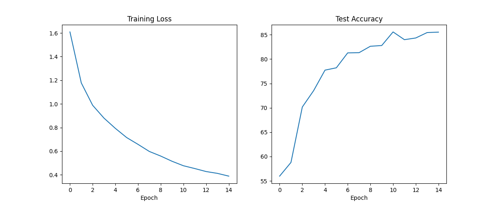

# CIFAR-10 CNN From Scratch (PyTorch)

## Project Overview
This project implements a Convolutional Neural Network trained from scratch on the CIFAR-10 dataset using PyTorch.
The goal was to design a CNN architecture capable of achieving at least 75% test accuracy. The final model achieved **85.53% test accuracy** after 15 epochs.

## Dataset

CIFAR-10  
- 60,000 32x32 RGB images  
- 10 classes  
- 50,000 training images  
- 10,000 test images  

## Model Architecture
Three Convolutional Blocks:
Conv → BatchNorm → ReLU → Conv → BatchNorm → ReLU → MaxPool

Followed by:
Fully Connected Layer  
Dropout (0.5)  
Output Layer (10 classes)

## Training Configuration

- Optimizer: Adam
- Learning Rate: 0.001
- Weight Decay: 1e-4
- Batch Size: 64
- Epochs: 15
- Data Augmentation:
  - RandomCrop
  - RandomHorizontalFlip
- Hardware: GPU (Google Colab)


## Final Results

Test Accuracy: **85.53%**

### Training Curve




## How to Run

```bash
pip install -r requirements.txt
